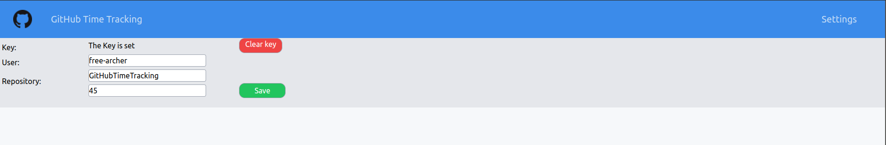
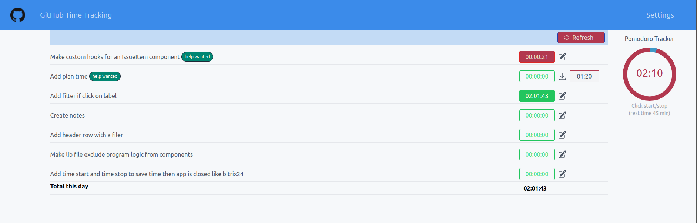
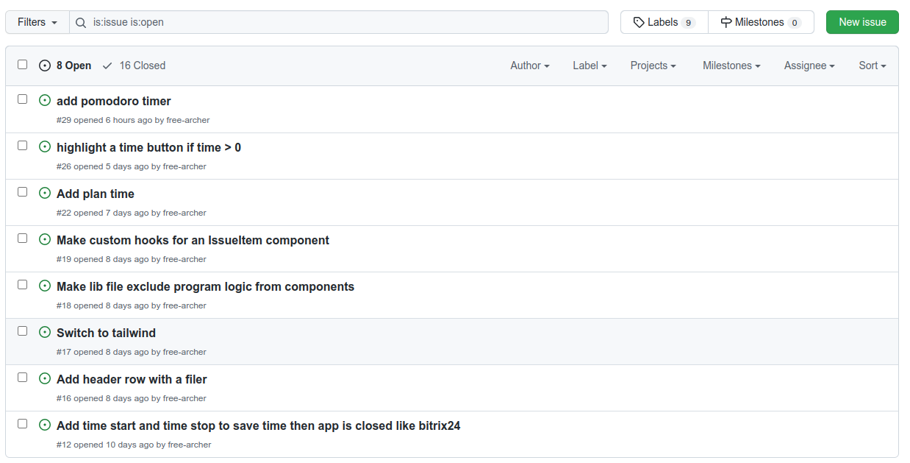
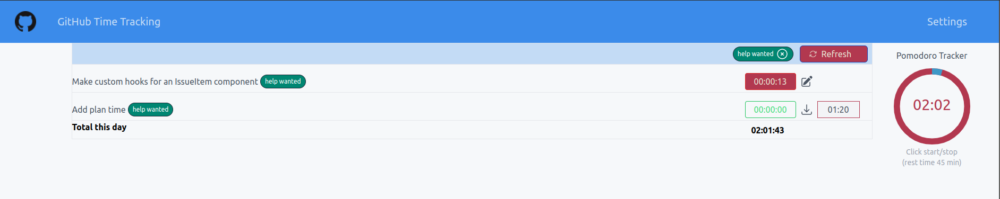

# Stack: Tauri + React + Typescript

GitHub Time Tracker is an application that allows you to register spending time on Issue.

The app show an issue list and button to start or stop the timer. Time saved in a LocalStorage of browser.

## To get started

**Clone the develop branch**
```
git clone https://github.com/free-archer/GitHubTimeTracking.git
cd GitHubTimeTracking
npm install
npm start
```

## Settings

Firstly get GitHub key for this app

See https://docs.github.com/en/developers/apps/building-github-apps/authenticating-with-github-apps

Next: Go to setting page and fill in username and repository name



## Work

After that go back to main window and you will see your list of github issues.





You can start and stop timer, also edit registered time manually.



## Contributing

I make this app for myself and use it everyday latest time. Now I'm not a professional programmer, I'm just learning. If you like this app, join me and offer your ideas.