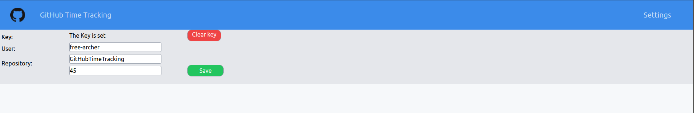
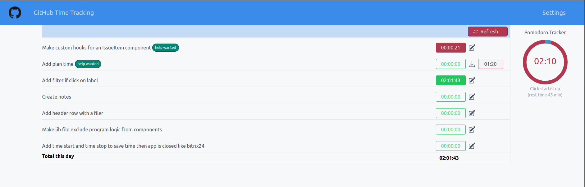
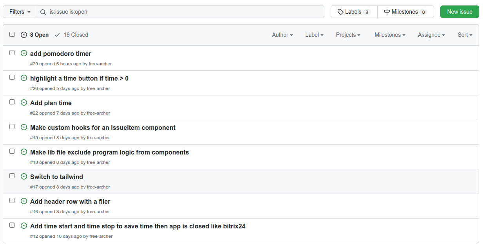
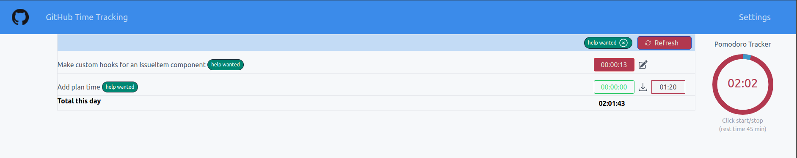

# GitHub Time Tracker 

GitHub Time Tracker is an application that allows you to register spending time on Issue.

The app show an issue list and button to start or stop the timer. Time saved in a LocalStorage of browser.

Stack: React + Typescript

## A little introduce

*I want to introduce you to my project, which I have been doing lately.
At work, I need to record the time I spend on tasks. At one time I used Bitrix24, but its functionality was too mutch for me. And the idea came to me to make a time tracker with GitHub as a backend.*

## Fast demo

There is demo link:
http://a0364987.xsph.ru

I pay attention that all data is saved only in your browser (in a LocalStorage).

Therefore, you can use this site for a while.

## Getting Started

```
git clone https://github.com/free-archer/GitHubTimeTracking.git
cd GitHubTimeTracking
npm install
npm start
```

### Settings

Firstly create a Personal Access Token (PAT) for this app.

Recommended option is Fine-grained PAT:
- Repository access: select your target repository.
- Repository permissions -> Issues: Read.

See documentation:
- https://docs.github.com/en/authentication/keeping-your-account-and-data-secure/managing-your-personal-access-tokens
- https://docs.github.com/en/rest/authentication/permissions-required-for-fine-grained-personal-access-tokens

Next: Go to **Setting** page and fill in a username and a repository name.



### Work

After that go back to main window and you will see your list of github issues.





You can start and stop timer, also edit registered time manually. 

Also, I added a Pomodoro Timer. It gets opportunity to control your work times. The Pomodoro Timer is not connected with the Time Tracker. It works independently.



### Contributing

I make this app for myself and use it everyday latest time. Now I'm not a professional programmer, I'm just learning. If you like this app, join me and offer your ideas.
